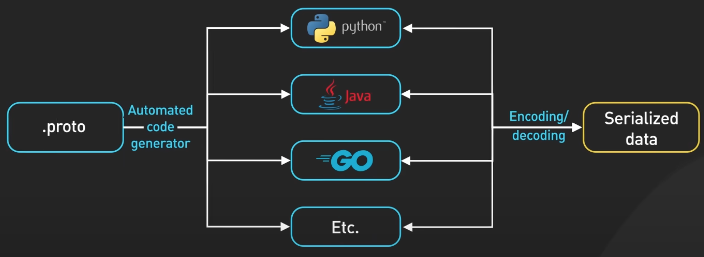

gRPC

<!--more-->

gRPC 是Google 于 2016年创建的开源远程过程调用框架，它是对Google内部 RPC 基础设施的重写。但首先，什么是RPC，即远程过程调用？本地过程调用是进程内执行某些代码的函数调用。远程过程调用从用户的角度来看，是使一台机器能够调用另一台机器上的某些代码，就像是本地函数调用一样。

gRPC 是RPC的一种流行实现。许多组织已采用 gRPC 作为首选RPC 机制来连接在数据中心内和跨数据中心运行的大量微服务。

What makes gRPC so popular?

gRPC 拥有蓬勃发展的开发者生态系统。它使得开发具有良好生产质量和可扩展性的类型安全API变得非常容易。该生态系统的核心是使用Protocol Buffers（协议缓冲区）作为其数据交换格式。Protocol Buffers是一种与语言和平台无关的结构化数据编码机制

gRPC 默认使用Protocol Buffers来编码并通过网络发送数据。虽然 gRPC 可以支持JSON等其他编码格式，但Protocol Buffers提供了几个优点，使其成为gRPC的首选编码格式。

Protocol Buffers支持强类型架构定义，网络上数据的结构在 proto文件中定义。Protocol Buffers提供广泛的工具支持，将 proto 文件中定义的模式转换为所有流行编程语言的数据访问类

gRPC 服务也是通过指定 RPC方法参数和返回类型在 proto 文件中定义的。

使用相同的工具从 proto 文件生成 gRPC 客户端和服务器代码。开发人员在客户端使用这些生成的类进行RPC调用，并在服务器中完成 RPC 请求。

通过支持多种编程语言，客户端和服务器可以独立选择最适合自己特定用例的编程语言和生态系统。传统上，大多数其他 RPC 框架并非如此。

gRPC 如此受欢迎的第二个原因是它开箱即用的高性能。有两个因素影响了其性能。

1. 首先， Protocol Buffers 是一种非常高效的二进制编码格式。它比JSON快得多。

2. 其次，gRPC建立在HTTP/2之上，以提供大规模的高性能基础。HTTP/2的使用带来了很多好处。gRPC 使用HTTP/2 stream。它允许通过单个长寿命TCP连接传输多条消息流。这使得gRPC 框架能够通过客户端和服务器之间的少量TCP连接处理许多并发RPC调用。

为了了解gRPC 的工作原理，让我们了解从 gRPC 客户端到gRPC 服务器的典型流程。在此示例中，订单服务是 gRPC 客户端，支付服务是gRPC 服务器。当订单服务向支付服务发出 gRPC调用时，它会在构建时调用由 gRPC 工具生成的客户端代码。生成的客户端代码称为客户端存根。gRPC将传递给客户端存根的数据编码到 Protocol Buffers 中，并将其发送到低级传输层。gRPC 通过网络将数据作为HTTP/2数据帧流发送。由于二进制编码和网络优化，据说gRPC比JSON快5倍。

支付服务从网络接收数据包，对其进行解码并调用服务器应用程序。从服务器应用程序返回的结果被编码到 Protocol Buffers 中并发送到传输层。订单服务接收数据包、解码并将结果发送到客户端应用程序。

从上面的例子我们看到，gRPC非常容易实现。如果这么简单，为什么我们没有看到Web客户端和 Web服务器之间广泛使用 gRPC？原因之一是gRPC 依赖于对HTTP/2 原语的低级访问。目前没有任何浏览器提供支持gRPC 客户端所需的 Web请求控制级别。可以借助代理从浏览器进行 gRPC调用。这项技术被称为gRPC-Web。但是，该功能集与 gRPC不完全兼容，并且与 gRPC 相比，其使用率仍然较低。

那么，gRPC的优点在哪里?我们应该何时使用它？gRPC是数据中心内微服务之间首选的服务间通信机制。它对多种编程语言的广泛支持jr使得服务能够选择最适合自身用例的语言和开发者生态系统。我们还看到原生移动客户端中 gRPC的使用越来越多。它的效率和性能在能源和带宽受限的移动设备环境中非常有意义。

